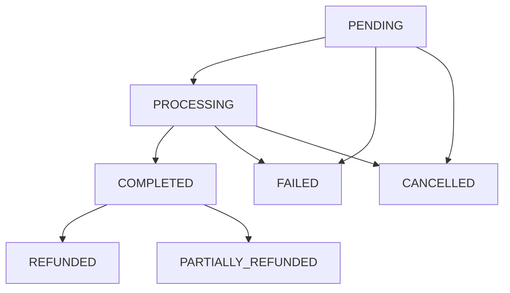

# Payments Service

A comprehensive payment processing microservice for the e-commerce platform, built with NestJS, PostgreSQL, GraphQL, and real-time WebSocket updates.

## 🚀 Features

- **Payment Processing**: Support for multiple payment methods and gateways
- **Real-time Updates**: WebSocket notifications for payment status changes
- **GraphQL API**: Modern API for payment operations and queries
- **Event-Driven Architecture**: Kafka integration for inter-service communication
- **Payment Lifecycle Management**: Complete payment workflow from creation to completion
- **Refund Management**: Full and partial refund capabilities
- **Multi-Gateway Support**: Extensible architecture for payment gateways
- **Security**: Encrypted payment data and secure transaction handling

## 🏗️ Architecture

### Core Components

- **Payment Entity**: PostgreSQL database schema for payment records
- **GraphQL API**: Type-safe API for payment operations
- **WebSocket Gateway**: Real-time payment status updates
- **Kafka Integration**: Event publishing and consumption
- **Payment Gateways**: Extensible gateway interface for payment processors

### Payment States



## 📊 API Overview

### GraphQL Schema

```graphql
type Payment {
  id: ID!
  orderId: String!
  userId: String!
  amount: Float!
  currency: Currency!
  status: PaymentStatus!
  paymentMethod: PaymentMethod!
  transactionId: String
  gatewayTransactionId: String
  paymentGateway: String
  refundedAmount: Float!
  failureReason: String
  refundReason: String
  createdAt: DateTime!
  updatedAt: DateTime!
  processedAt: DateTime
  refundedAt: DateTime
  remainingAmount: Float!
  canProcess: Boolean!
  canRefund: Boolean!
  canCancel: Boolean!
}

type Query {
  payment(id: ID!): Payment!
  payments(filters: PaymentFilters, pagination: PaginationInput): PaginatedPayments!
  paymentSummary(filters: PaymentFilters): PaymentSummary!
  paymentsByOrder(orderId: ID!): [Payment!]!
}

type Mutation {
  createPayment(input: CreatePaymentInput!): Payment!
  processPayment(input: ProcessPaymentInput!): Payment!
  completePayment(paymentId: ID!, transactionId: String): Payment!
  failPayment(paymentId: ID!, reason: String): Payment!
  refundPayment(input: RefundPaymentInput!): Payment!
  cancelPayment(input: CancelPaymentInput!): Payment!
  retryPayment(paymentId: ID!): Boolean!
}
```

## 🔧 Setup & Installation

### Prerequisites

- Node.js 18+
- PostgreSQL 16+
- Kafka 7.5+
- Redis (optional, for caching)

### Environment Variables

```bash
# Database Configuration
PAYMENTS_DB_HOST=localhost
PAYMENTS_DB_PORT=5432
PAYMENTS_DB_USERNAME=postgres
PAYMENTS_DB_PASSWORD=password
PAYMENTS_DB_NAME=payments

# Service Configuration
PAYMENTS_SERVICE_PORT=4004
NODE_ENV=development

# Kafka Configuration
KAFKA_BROKERS=localhost:9092

# Payment Gateway Configuration
STRIPE_SECRET_KEY=sk_test_...
PAYPAL_CLIENT_ID=...
PAYPAL_CLIENT_SECRET=...
```

### Installation

```bash
# Install dependencies
npm install

# Start the service
npm run start:payments
```

### Docker Setup

```yaml
version: '3.8'
services:
  payments-db:
    image: postgres:16-alpine
    environment:
      POSTGRES_DB: payments
      POSTGRES_USER: postgres
      POSTGRES_PASSWORD: password
    ports:
      - "5433:5432"

  payments-service:
    build: ./apps/payments-service
    ports:
      - "4004:4004"
    environment:
      - PAYMENTS_DB_HOST=payments-db
      - KAFKA_BROKERS=kafka:9092
    depends_on:
      - payments-db
      - kafka
```

## 💳 Payment Methods

### Supported Payment Methods

- **Credit/Debit Cards**: Visa, Mastercard, American Express
- **Digital Wallets**: PayPal, Apple Pay, Google Pay
- **Bank Transfer**: ACH, Wire Transfer
- **Cryptocurrency**: Bitcoin, Ethereum (future)

### Gateway Integration

The service supports multiple payment gateways through a unified interface:

```typescript
interface PaymentGateway {
  processPayment(paymentData: PaymentData): Promise<PaymentResult>;
  refundPayment(transactionId: string, amount: number): Promise<RefundResult>;
  validatePaymentMethod(data: any): Promise<boolean>;
}
```

## 🔄 Real-Time Features

### WebSocket Events

Connect to the WebSocket gateway for real-time payment updates:

```javascript
import io from 'socket.io-client';

const socket = io('http://localhost:4004/payments');

// Authenticate
socket.emit('authenticate', { token: 'jwt-token' });

// Subscribe to payments
socket.emit('subscribeToPayments');

// Listen for events
socket.on('paymentCreated', (data) => {
  console.log('Payment created:', data.payment);
});

socket.on('paymentCompleted', (data) => {
  console.log('Payment completed:', data.payment);
});

socket.on('paymentRefunded', (data) => {
  console.log('Payment refunded:', data.refundAmount);
});
```

### Event Types

- `paymentCreated`: New payment initiated
- `paymentProcessing`: Payment being processed
- `paymentCompleted`: Payment successfully completed
- `paymentFailed`: Payment processing failed
- `paymentRefunded`: Payment refund processed
- `paymentCancelled`: Payment cancelled

## 📡 Kafka Events

### Published Events

```typescript
// Payment Created
{
  topic: 'payment.created',
  data: {
    paymentId: 'uuid',
    orderId: 'uuid',
    userId: 'uuid',
    amount: 99.99,
    currency: 'USD',
    paymentMethod: 'CREDIT_CARD'
  }
}

// Payment Completed
{
  topic: 'payment.completed',
  data: {
    paymentId: 'uuid',
    orderId: 'uuid',
    transactionId: 'txn_123',
    amount: 99.99
  }
}
```

### Consumed Events

- `order.created`: Create payment record for new orders
- `order.cancelled`: Cancel pending payments for cancelled orders

## 🧪 Testing

### WebSocket Testing

```bash
# Interactive WebSocket test script
npm run test:payments-websocket
```

### GraphQL Testing

```bash
# Create a payment
mutation CreatePayment($input: CreatePaymentInput!) {
  createPayment(input: $input) {
    id
    amount
    status
    paymentMethod
  }
}

# Variables
{
  "input": {
    "orderId": "order-uuid",
    "amount": 99.99,
    "paymentMethod": "CREDIT_CARD",
    "paymentData": "{\"token\": \"tok_123\"}"
  }
}
```

### Load Testing

```bash
# Simulate concurrent payments
npm run test:load-payments
```

## 🔒 Security

### Data Protection

- Payment data encrypted at rest using AES-256
- PCI DSS compliance for card data handling
- JWT authentication for API access
- Rate limiting and fraud detection

### Best Practices

- Never store full card numbers
- Use tokenization for payment methods
- Implement proper audit logging
- Regular security updates and patches

## 📈 Monitoring & Analytics

### Metrics

- Payment success/failure rates
- Processing times by gateway
- Refund amounts and frequencies
- Geographic payment distribution

### Health Checks

```typescript
// Health endpoint
GET /health

// Readiness probe
GET /ready

// Metrics endpoint
GET /metrics
```

## 🚀 Production Deployment

### Kubernetes Manifests

```yaml
apiVersion: apps/v1
kind: Deployment
metadata:
  name: payments-service
spec:
  replicas: 3
  template:
    spec:
      containers:
      - name: payments-service
        image: payments-service:latest
        ports:
        - containerPort: 4004
        env:
        - name: KAFKA_BROKERS
          value: "kafka-cluster:9092"
        livenessProbe:
          httpGet:
            path: /health
            port: 4004
          initialDelaySeconds: 30
          periodSeconds: 10
```

### Scaling Considerations

- Horizontal scaling with multiple replicas
- Database connection pooling
- Redis caching for payment metadata
- CDN for static assets

## 🔧 Development

### Project Structure

```
apps/payments-service/
├── src/
│   ├── payment.entity.ts       # Database entity
│   ├── payment.types.ts        # GraphQL types
│   ├── payment.dto.ts          # Input validation
│   ├── payment.resolver.ts     # GraphQL resolvers
│   ├── payment.service.ts      # Business logic
│   ├── payment.gateway.ts      # WebSocket gateway
│   ├── payment-gateway.interface.ts # Gateway abstraction
│   ├── payments-service.module.ts   # Module configuration
│   └── main.ts                  # Application bootstrap
├── test/
└── README.md
```

### Adding New Payment Gateways

1. Implement the `PaymentGateway` interface
2. Register the gateway in the service
3. Add gateway-specific configuration
4. Update environment variables

```typescript
// Example: Adding a new gateway
@Injectable()
export class CryptoGateway implements PaymentGateway {
  name = 'crypto';

  async processPayment(paymentData: PaymentData): Promise<PaymentResult> {
    // Implement crypto payment processing
  }
}
```

## 📚 API Documentation

### Complete GraphQL Schema

Access the GraphQL playground at `http://localhost:4004/graphql` for interactive API documentation and testing.

### REST Endpoints

- `GET /health` - Service health check
- `GET /metrics` - Prometheus metrics
- `POST /graphql` - GraphQL endpoint

## 🤝 Contributing

1. Fork the repository
2. Create a feature branch
3. Add tests for new functionality
4. Ensure all tests pass
5. Submit a pull request

## 📄 License

This project is licensed under the MIT License - see the LICENSE file for details.

---

**Payments Service** - Enterprise-grade payment processing for modern e-commerce platforms.